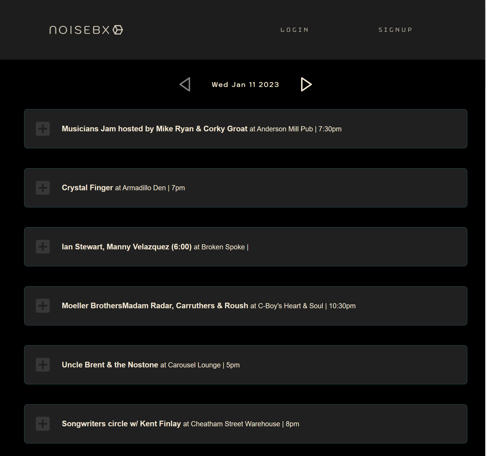
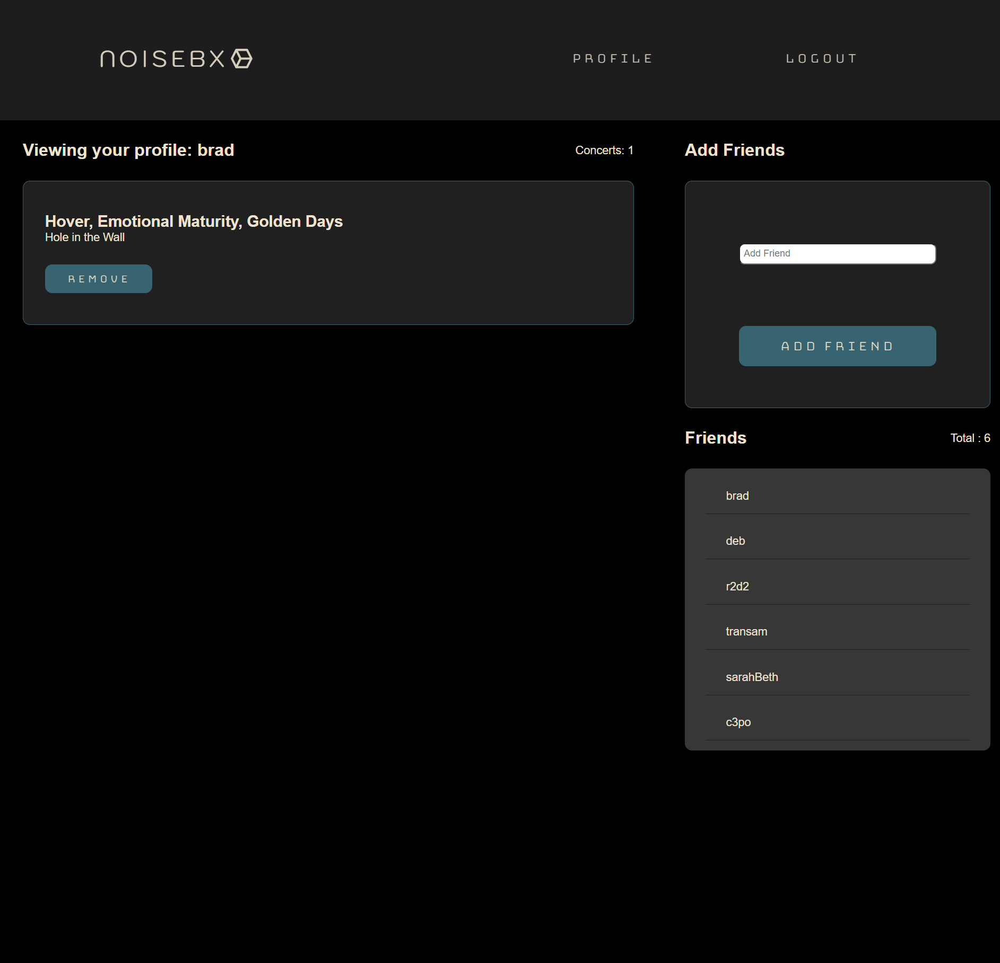

# <h1 align="center">NOISEBX</h1>

<h2 align="center">🎸🎹Local Concert Listing React App🎹🎸</h2>

## Technologies Used 💻

## Description

* A Single Page React App that scrapes local concert listings from free to use information websites and displays them depending on the day selected. 

* When a user is logged in, they then have the ability to save a concert to their profile. 

* When a show is clicked on from the homepage the user is taken to a page that displays full details about the show.  The ability to see the venue location via google maps, add it to google calendar, and other details will be added soon. 

*  The option to RSVP yes, no, or maybe and add/remove the show from the user's profile is available if logged in.  The number of RSVP's are tallied and the number is displayed allowing users to have some expectations about attendance.

* On the profile page the user is shown a list of their saved shows as well as their friend list and the ability to add friends if they know the user name.  The ability to remove, block or approve friend requests will be added soon. 

## Local Development

* Run `npm init -y` from the command line 
* Run `npm i` to install dependencies

## Usage

* Run `mongod` from the command line
* Run `npm run develop` from the command line

## Deployment

* Be advised, mobile responsivness is currently under development
* The scraper in it's current form times out on Heroku.  Because of this it only scrapes a small    amount of days at a time. This fix is currently under development and will be updated soon. 
* Deployed to Heroku [here](https://whispering-retreat-35925.herokuapp.com/)

### Made with ❤️ by  Brad Dunham
